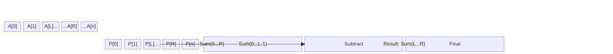

# Level 2: The Engineer's Standard (Intermediate)

## 1. Definition and Formal Logic

The **Prefix Sum** is a preprocessing technique used to answer range sum queries in constant time $O(1)$.

Given an array $A$ of size $N$, we construct a prefix sum array $P$ of size $N$ (or $N+1$ for 0-based convenience) such that:

$$P[i] = \sum_{k=0}^{i} A[k]$$

### The Recurrence Relation
$$P[i] = P[i-1] + A[i]$$
*(Base case: $P[0] = A[0]$)*


## 2. Key Operation: Range Sum Query

To find the sum of a subarray $A[L \dots R]$ (inclusive):

$$Sum(L, R) = P[R] - P[L-1]$$
*(Handle boundary condition where $L=0$ typically by checking if $L>0$ or using a padded array).*

### Visualization


## 3. Complexity Analysis

| Operation | Time Complexity | Space Complexity |
|:--- |:--- |:--- |
| **Preprocessing** | $O(N)$ | $O(N)$ |
| **Range Query** | $O(1)$ | $O(1)$ |

### Performance Comparison
```mermaid
xychart-beta
    title "Query Time: Naive vs Prefix Sum"
    x-axis [10, 100, 1000, 10000]
    y-axis "Operations" 0 --> 10000
    line [10, 100, 1000, 10000] text "Naive O(N)"
    line [1, 1, 1, 1] text "Prefix Sum O(1)"
```

Without this technique, a range sum query would take $O(N)$ in the worst case (summing elements one by one). If you have $Q$ queries, the naive approach takes $O(Q \cdot N)$, whereas the prefix sum approach takes $O(N + Q)$. For large $Q$, this is a massive optimization.

## 4. Standard Use Cases

1.  **Static Range Sum Queries**: When the array doesn't change, and you need to query sums frequently.
2.  **Equilibrium Index**: Finding a pivot where the sum of the left side equals the sum of the right side.
3.  **2D Prefix Sums**: Extending the concept to matrices to calculate the sum of sub-rectangles in $O(1)$.
4.  **Difference Arrays**: Using the inverse concept (storing $A[i] - A[i-1]$) to perform efficient range updates.
