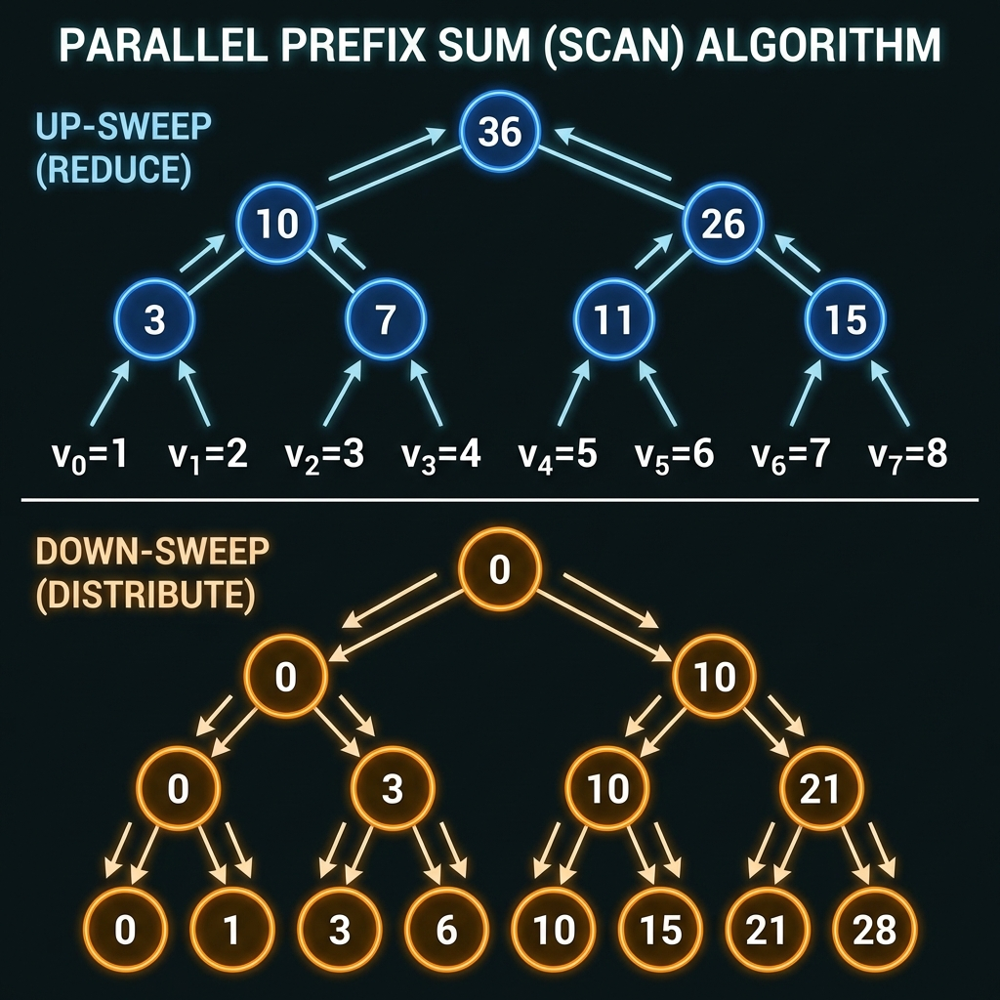

# Level 3: Deep Dive & Optimization (Expert)

## 1. Memory Hierarchy & Cache Locality

Prefix sum calculations are inherently **sequential** in their basic form ($P[i] = P[i-1] + A[i]$), which creates a **data dependency**. However, the access pattern is strictly linear, which is excellent for **spatial locality**.

-   **Prefetching**: Modern CPUs will effectively prefetch the input array $A$.
-   **Write-Combine**: If generating the prefix array into a new buffer, the sequential writes allow the CPU to use write-combining buffers, minimizing bus traffic.

## 2. Parallel Prefix Sum (Scan)

While the recurrence relation looks serial, prefix sums can be parallelized using the **Hillis-Steele** or **Blelloch** scan algorithms. This is crucial for GPU computing (CUDA/OpenCL) or utilizing SIMD/multi-threading on large datasets.

### Basic Parallel Approach (Work-Efficient)

The **Blelloch Scan** algorithm consists of two phases:

1.  **Up-Sweep (Reduce)**: Build a tree of partial sums. Complexity $O(N)$.
2.  **Down-Sweep**: Traverse the tree to distribute values. Complexity $O(N)$.

This allows calculating prefix sums in $O(\log N)$ span (critical path) with $O(N)$ work, enabling massive parallelism.

## 3. Mutable vs. Immutable

Standard prefix sum arrays are **static**. If the underlying array $A$ changes (point update), rebuilding the prefix array takes $O(N)$.
For scenarios requiring both **$O(\log N)$ updates** and **$O(\log N)$ queries**, we upgrade to dynamic structures:

-   **Binary Indexed Tree (Fenwick Tree)**: implicit data structure, very memory efficient.
-   **Segment Tree**: More flexible, handles min/max/gcd queries in addition to sum.

## 4. Overflow Considerations

For 32-bit integers, the sum can quickly exceed $2 \cdot 10^9$.
-   **Signed vs Unsigned**: In C++, signed overflow is UB.
-   **64-bit Integers**: Generally preferred for prefix sums unless domain is strictly small.
-   **Language Specifics**: Python handles arbitrary precision automatically; JS uses double-precision floats (safe integer limit $\pm 2^{53}$).

## 5. Generalized Prefix Operations

The concept generalizes to any associative operator (multiplication, XOR, matrix multiplication), not just addition.
-   **XOR Prefix**: Used to find subarrays with XOR sum = K, or to solve problems like "find the odd occurring element in a range".
-   **Product Prefix**: Carefully handle zeros.
